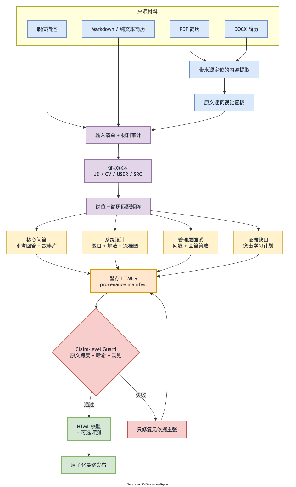
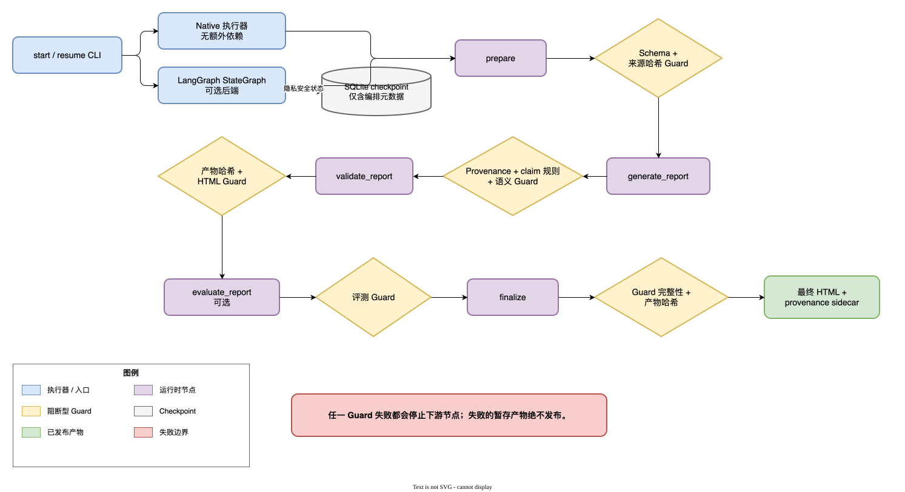

<div align="center">

# Interview Prep Skill

**基于岗位描述和个人简历，生成有证据支撑的面试准备材料。**

生成一份自包含的可视化 HTML 报告，内含岗位与简历匹配分析、基于简历的回答、项目深挖、双语练习，以及针对能力缺口的突击学习计划。

[](LICENSE)
[](https://www.python.org/)
[](#报告输出)

<a href="./README.md"></a>
<a href="./README.cn.md"></a>

[功能](#功能) · [安装](#安装) · [使用](#使用) · [测试](#测试) · [许可证](#许可证)

</div>

---

## 功能

- **岗位与简历映射**：将每项岗位要求分类为强匹配、部分匹配、无证据或待确认。
- **基于简历的回答**：根据候选人的真实项目、职责、决策和结果，构建第一人称参考回答。
- **证据台账**：为事实性主张关联稳定的 `JD-*`、`CV-*`、`USER-*` 和 `SRC-*` ID。
- **中英文支持**：分别设置岗位描述、简历、面试、报告和回答的语言。
- **项目深挖**：围绕简历中的真实项目准备技术问题、行为问题、压力问题和追问。
- **系统设计专项**：根据 JD 信号生成 2–3 道可能的系统设计题，并提供需求、架构/数据流图、故障处理、取舍和显式假设。
- **管理层面试专项**：准备高价值主管问题、基于证据的回答方案、压力追问，以及缺少管理经历证据时的诚实边界。
- **Claim 级原文 Guard**：将可见主张绑定到带哈希的原文片段，并阻断无依据事实、贡献升级、数字冲突和模糊推断。
- **DAG 运行器与分阶段发布**：记录 Guard 状态，只有校验和可选评测通过后才发布 HTML 及其 provenance sidecar。
- **针对缺口的学习计划**：针对简历中缺失的重要岗位要求，检索官方优先的学习资料。
- **确定性文档提取**：在分析前，将 PDF 和 DOCX 简历转换为带来源位置的中间 Markdown。
- **默认生成可视化 HTML**：输出一个响应式、可打印、可离线打开的单文件，不依赖 CDN、远程字体、分析脚本或构建步骤。
- **隐私感知输出**：不在报告中包含私人电话、邮箱、身份证号码和详细住址。

## 工作流程

[](docs/diagrams/interview-prep-workflow.zh.drawio)

该图使用 Draw.io 生成；点击图片可打开对应的可编辑 `.drawio` 源文件。

## 报告输出

默认 HTML 报告包含：

- 岗位概况和材料完整性说明；
- 语言配置和跨语言术语；
- 证据台账和岗位要求—简历证据匹配矩阵；
- 定制自我介绍和可复用故事库；
- 按优先级排序的面试问题，以及 60–120 秒参考回答；
- 追问、项目深挖、技术问题和压力问题；
- 2–3 道基于 JD 推导的系统设计练习，包含架构/数据流图、可靠性分析和取舍；信号不足时明确标记不适用；
- 6–8 道管理层问题，包含回答方案、故事证据、压力追问和禁止虚构项；
- 带时间盒和可验证练习的缺口学习资料；
- 反向提问、准备计划、一页速查表和待确认清单；
- 章节导航、问题搜索、展开/收起控件和打印样式。

报告会避免无证据的匹配百分比、虚构成果，以及将短期学习表述为生产环境经验。

## 安装

### 安装为 Codex Skill

```bash
git clone https://github.com/chenyangwei-dev/interview-prep-skill.git \
  ~/.codex/skills/interview-prep
```

安装后重启或刷新 Codex，使其发现该 Skill。

### 可选 Python 依赖

PDF 提取器优先使用 `pdfplumber`，失败时回退到 `pypdf`：

```bash
python -m pip install pdfplumber pypdf
```

DOCX 提取使用 Python 标准库，不需要 `python-docx`。

开发和覆盖率报告需要：

```bash
python -m pip install coverage
```

LangGraph 是可选执行后端；只有显式选择 `--engine langgraph` 时才需要安装：

```bash
python -m pip install -r requirements-langgraph.txt
```

渲染 PDF 或 DOCX 页面用于可视化检查时，执行环境可能还需要 Poppler 和 LibreOffice。

## 使用

使用岗位信息和简历调用 Skill：

```text
使用 $interview-prep，根据这个 Boss 直聘岗位和我的 PDF 简历，
生成一份中文可视化面试准备报告，并为简历缺失的岗位要求提供突击学习资料。
```

也可以分别指定报告和面试回答语言：

```text
使用 $interview-prep 处理这个英文岗位和我的中文简历。
报告用中文，面试回答用英文。
```

支持的输入：

| 材料 | 支持形式 |
|---|---|
| 岗位信息 | 公开网址、粘贴文本、截图、PDF |
| 简历 | PDF、DOCX、Markdown、纯文本、粘贴的工作经历 |
| 语言 | 中文、英文、中英混合输入、双语练习 |
| 默认输出 | 一个自包含 `.html` 文件 |

默认 `native` 工作流不需要 LangChain 或 LangGraph。需要持久化图 checkpoint、后续节点级恢复或人工审核扩展时，可以显式选择 LangGraph 后端。

## 带 Guard 的 DAG 运行器

当 JD 与简历能够保存为本地文件时，创建运行目录和标准化生成请求：

```bash
python scripts/run_interview_prep.py start \
  --job work/job.json \
  --run-dir work/runs/example
```

未配置生成器时，runner 以退出码 `3` 返回 `WAITING_FOR_GENERATION`。按照请求同时生成 HTML 与 claim-level provenance manifest，然后恢复同一运行：

```bash
python scripts/run_interview_prep.py resume \
  --run-dir work/runs/example \
  --report outputs/company-role-interview-prep.html \
  --provenance outputs/company-role-interview-prep.html.provenance.json
```

查看完整内容图、当前可执行图或隐私安全状态：

```bash
python scripts/run_interview_prep.py plan
python scripts/run_interview_prep.py plan --runtime
python scripts/run_interview_prep.py status --run-dir work/runs/example
```

当前实际 runtime 使用五个粗粒度节点：`prepare → generate_report → validate_report → evaluate_report（可选）→ finalize`。证据、匹配、故事、系统设计和管理层问答等细粒度节点已经声明，但目前仍在整体 generator 内执行，尚未实现章节级执行与缓存。

两个执行后端共享相同节点函数和 Guard：

[](docs/diagrams/guarded-dag-runtime.zh.drawio)

每个运行时节点后都有对应的阻断型 Guard；点击图片可打开可编辑的 Draw.io 源文件。

选择 LangGraph：

```bash
python scripts/run_interview_prep.py start \
  --job work/job.json \
  --run-dir work/runs/example \
  --engine langgraph
```

LangGraph 会在运行目录创建 `langgraph-checkpoints.sqlite`，其中只保存运行 ID、路径、返回码和最后节点等编排元数据。`state.json`、`guards/*.json` 和 provenance manifest 仍是恢复、可信判断与发布门禁的依据；LangGraph checkpoint 本身不能证明内容有原文支持。

manifest 必须包含完整的标准化输入哈希集合，并通过 `data-claim-id` 绑定每个可见主张。原文完全包含的来源事实可以通过确定性 span 检查；释义和推断需要配置 semantic checker。失败的 staging 产物不会覆盖用户指定的最终报告。

## 中间文档提取

将 PDF 简历转换为 Markdown：

```bash
python scripts/extract_pdf.py resume.pdf \
  --output /tmp/resume.extracted.md
```

将 DOCX 简历转换为 Markdown：

```bash
python scripts/extract_docx.py resume.docx \
  --output /tmp/resume.extracted.md
```

只有在明确需要替换已有中间文件时才使用 `--overwrite`。

PDF 位置使用 `PDF-p001` 之类的 ID。DOCX 位置使用 `DOCX-body-p0001` 和 `DOCX-body-t01-r02-c01` 之类的段落及表格坐标。分析层会将这些物理位置映射为 `CV-01` 之类的语义证据 ID。

中间 Markdown 可能包含简历中的个人信息。请将其保留在临时工作区，不要提交到 Git，也不要将其视为默认交付物。

## 验证生成的报告

```bash
python scripts/validate_report.py path/to/interview-prep-report.html
```

验证器会检查必需章节、未解决占位符、语义结构、响应式与打印样式、证据标签指引、不安全内联事件处理器、`innerHTML` 和外部资产依赖。

确定性验证不能替代可视化检查。交付前，请分别在桌面端和移动端宽度下打开报告，检查导航、长表格、问题控件和打印排版。

## 测试

运行快速、隔离的单元测试：

```bash
python -m unittest discover -s tests/unit -p "test_*.py" -v
```

运行跨进程和端到端回归测试：

```bash
python -m unittest discover -s tests/regression -p "test_*.py" -v
```

运行确定性的 Skill 输出回归案例：

```bash
python evals/run_eval.py --use-samples --require-all
```

运行行覆盖率和分支覆盖率：

```bash
python -m coverage erase
python -m coverage run --branch --source=scripts \
  -m unittest discover -s tests/unit -p "test_*.py"
python -m coverage run --append --branch --source=scripts \
  -m unittest discover -s tests/regression -p "test_*.py"
python -m coverage report -m
```

单元测试覆盖独立的渲染器、提取器、验证器和评估器。回归测试覆盖完整的命令行提取、带检查点工作流、DAG 校验、provenance Guard 和最终发布边界。`evals/run_eval.py` 保持独立，因为它评估生成报告的质量，而不是 Python 实现单元。

## 项目结构

```text
interview-prep-skill/
├── README.md                        # 英文项目文档
├── README.cn.md                     # 简体中文项目文档
├── requirements-langgraph.txt       # 可选 LangGraph 与 SQLite checkpoint 依赖
├── LICENSE                          # Apache License 2.0
├── SKILL.md                         # 核心工作流与行为约定
├── agents/openai.yaml              # Skill 展示元数据
├── assets/                         # 中英文 HTML/Markdown 模板
├── docs/diagrams/                  # 可编辑 Draw.io 源文件和 README SVG 导出图
├── references/                     # 证据、语言、问题、学习和 HTML 策略
├── scripts/
│   ├── extract_pdf.py              # PDF → 带来源位置的 Markdown
│   ├── extract_docx.py             # DOCX OOXML → 带来源位置的 Markdown
│   ├── extraction_common.py        # 共享 Markdown 模式与写入器
│   ├── dag.py                       # 依赖图声明与校验
│   ├── provenance.py                # 原文 span 与 claim 溯源原语
│   ├── guards.py                    # 阻断型 artifact 与 grounding Guard
│   ├── langgraph_runtime.py         # 可选 LangGraph StateGraph 执行后端
│   ├── run_interview_prep.py        # 分阶段 DAG runner 与最终发布门禁
│   └── validate_report.py           # 确定性 HTML 验证器
├── evals/                          # 脱敏的 Skill 输出回归案例及运行器
└── tests/
    ├── unit/                       # 快速、隔离的 Python 单元测试
    └── regression/                 # 跨进程和端到端 Python 回归测试
```

## 证据与真实性边界

- 简历证据可以支撑候选人的主张；通用技术知识不会因此变成个人经历。
- 团队成果不会自动成为个人成果。
- 缺失的数字、角色、日期和结果会保持为待确认状态。
- 完成学习练习不会将简历要求从“无证据”改成“已匹配”。
- 外部来源只支持学习材料，不支持关于候选人工作经历的主张。
- 真实 Evidence ID 本身并不充分；被引用的原文片段必须实际支持渲染主张。
- 推断、建议、假设、知识参考和未知项必须显式标记，不能升级为来源事实。

## 贡献

欢迎提交 Issue 和 Pull Request，改进文档提取边缘情况、证据保护、语言质量、HTML 可访问性、报告验证和岗位特定问题模式。

打开 Pull Request 前，请运行：

```bash
python -m unittest discover -s tests/unit -p "test_*.py" -v
python -m unittest discover -s tests/regression -p "test_*.py" -v
python evals/run_eval.py --use-samples --require-all
python -m coverage erase
python -m coverage run --branch --source=scripts \
  -m unittest discover -s tests/unit -p "test_*.py"
python -m coverage run --append --branch --source=scripts \
  -m unittest discover -s tests/regression -p "test_*.py"
python -m coverage report -m
```

请勿提交真实简历、提取后的个人数据、包含私人信息的生成报告、访问令牌或网站会话凭据。

## 许可证

本项目使用 [Apache License 2.0](LICENSE)。
