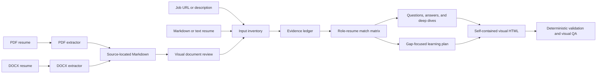

<div align="center">

# Interview Prep Skill

**Evidence-grounded interview preparation from a job description and your own resume.**

Generate a self-contained visual HTML report with role-resume fit analysis, resume-specific answers, project deep dives, bilingual practice, and a focused study plan for missing skills.

[](LICENSE)
[](https://www.python.org/)
[](#report-output)

<a href="./README.md"></a>
<a href="./README.cn.md"></a>

[Features](#features) · [Installation](#installation) · [Usage](#usage) · [Testing](#testing) · [License](#license)

</div>

---

## Features

- **Job-to-resume mapping** — classify each requirement as strong match, partial match, no evidence, or needs confirmation.
- **Resume-specific answers** — build first-person answers from the candidate's actual projects, responsibilities, decisions, and results.
- **Evidence ledger** — attach stable `JD-*`, `CV-*`, `USER-*`, and `SRC-*` IDs to factual claims.
- **Chinese and English support** — independently route the languages of the job description, resume, interview, report, and answers.
- **Project deep dives** — prepare technical, behavioral, pressure, and follow-up questions around real resume projects.
- **Gap-focused study plan** — research first-party learning resources for important JD requirements that are missing from the resume.
- **Deterministic document extraction** — convert PDF and DOCX resumes into source-located intermediate Markdown before analysis.
- **Visual HTML by default** — produce one responsive, printable, self-contained file without CDN, remote fonts, analytics, or build steps.
- **Privacy-aware output** — exclude private phone numbers, email addresses, identity numbers, and detailed addresses from the report.

## How it works



The extractors create a content index, not a layout truth. PDF pages and complex DOCX files still require visual review for columns, text boxes, tables, images, missing glyphs, and OCR issues.

## Report output

The default HTML report includes:

- role profile and material-completeness notice;
- language configuration and cross-language terminology;
- evidence ledger and requirement-to-resume match matrix;
- tailored self-introduction and reusable story bank;
- prioritized interview questions with 60–120 second reference answers;
- follow-up questions, project deep dives, technical questions, and pressure questions;
- gap-focused learning resources with time boxes and verifiable exercises;
- reverse questions, preparation plan, one-page cheat sheet, and confirmation list;
- section navigation, question search, expand/collapse controls, and print styling.

The report deliberately avoids unsupported match percentages, invented achievements, and claims that turn short-term study into production experience.

## Installation

### Install as a Codex skill

```bash
git clone https://github.com/chenyangwei-dev/interview-prep-skill.git \
  ~/.codex/skills/interview-prep
```

Restart or refresh Codex after installation so the skill can be discovered.

### Optional Python dependencies

The PDF extractor uses `pdfplumber` first and falls back to `pypdf`:

```bash
python -m pip install pdfplumber pypdf
```

DOCX extraction uses Python's standard library and does not require `python-docx`.

For development and coverage reporting:

```bash
python -m pip install coverage
```

Rendering PDF or DOCX pages for visual inspection may additionally require Poppler and LibreOffice in the execution environment.

## Usage

Invoke the skill with a job listing and a resume:

```text
Use $interview-prep with this job URL and my attached resume.
Generate a Chinese report, but prepare the interview answers in English.
```

Supported inputs:

| Material | Supported forms |
|---|---|
| Job listing | Public URL, pasted text, screenshot, PDF |
| Resume | PDF, DOCX, Markdown, plain text, pasted experience |
| Languages | Chinese, English, mixed-language inputs, bilingual practice |
| Default output | One self-contained `.html` file |

No LangChain installation is required for the skill workflow. A separate application, persistent knowledge base, or large retrieval system may justify an orchestration framework, but ordinary interview preparation does not.

## Intermediate document extraction

Convert a PDF resume to Markdown:

```bash
python scripts/extract_pdf.py resume.pdf \
  --output /tmp/resume.extracted.md
```

Convert a DOCX resume to Markdown:

```bash
python scripts/extract_docx.py resume.docx \
  --output /tmp/resume.extracted.md
```

Use `--overwrite` only when intentionally replacing an existing intermediate file.

PDF locations use IDs such as `PDF-p001`. DOCX locations use paragraph and table coordinates such as `DOCX-body-p0001` and `DOCX-body-t01-r02-c01`. The analysis layer maps those physical locations to semantic evidence IDs such as `CV-01`.

Intermediate Markdown may contain personal resume data. Keep it in a temporary workspace, do not commit it to Git, and do not treat it as a default deliverable.

## Validate a generated report

```bash
python scripts/validate_report.py path/to/interview-prep-report.html
```

The validator checks required sections, unresolved placeholders, semantic structure, responsive and print styles, evidence-label guidance, unsafe inline handlers, `innerHTML`, and external asset dependencies.

Validation is not a replacement for visual inspection. Open the report at desktop and mobile widths and check navigation, long tables, question controls, and print layout before delivery.

## Testing

Run the unit and integration tests:

```bash
python -m unittest discover -s tests -v
```

Run line and branch coverage:

```bash
python -m coverage run --branch --source=scripts \
  -m unittest discover -s tests
python -m coverage report -m
```

The test suite covers the shared Markdown renderer, PDF extraction and fallback behavior, DOCX OOXML extraction and warnings, command-line safeguards, and HTML report validation.

## Project structure

```text
interview-prep-skill/
├── README.md                        # English project documentation
├── README.cn.md                     # Simplified Chinese project documentation
├── LICENSE                          # Apache License 2.0
├── SKILL.md                         # Core workflow and behavioral contract
├── agents/openai.yaml              # Skill display metadata
├── assets/                         # Chinese and English HTML/Markdown templates
├── references/                     # Evidence, language, questions, learning, HTML policies
├── scripts/
│   ├── extract_pdf.py              # PDF → source-located Markdown
│   ├── extract_docx.py             # DOCX OOXML → source-located Markdown
│   ├── extraction_common.py        # Shared Markdown schema and writer
│   └── validate_report.py          # Deterministic HTML validator
└── tests/                          # Unit and integration tests
```

## Evidence and honesty boundaries

- Resume evidence supports candidate claims; general technical knowledge does not become personal experience.
- Team outcomes do not automatically become individual achievements.
- Missing numbers, roles, dates, and results remain marked as pending confirmation.
- Completing a study exercise does not change a resume requirement from “no evidence” to “matched.”
- External sources support learning material, not claims about the candidate's employment history.

## Contributing

Issues and pull requests are welcome for extraction edge cases, evidence safeguards, language quality, HTML accessibility, report validation, and new role-specific question patterns.

Before opening a pull request, run:

```bash
python -m unittest discover -s tests -v
python -m coverage run --branch --source=scripts \
  -m unittest discover -s tests
python -m coverage report -m
```

Do not commit real resumes, extracted personal data, generated reports containing private information, access tokens, or website session credentials.

## License

This project is licensed under the [Apache License 2.0](LICENSE).
