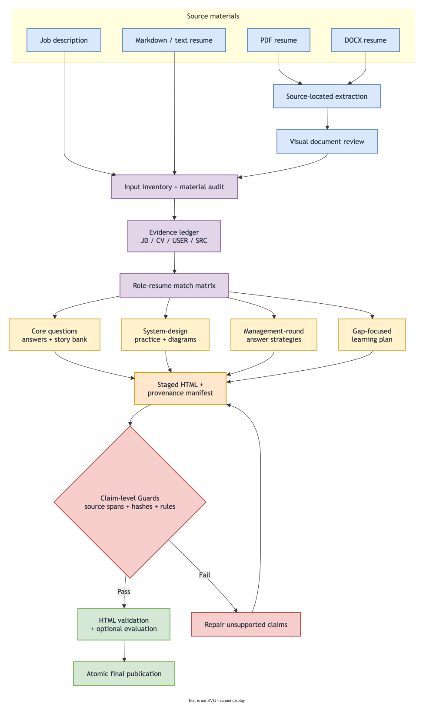
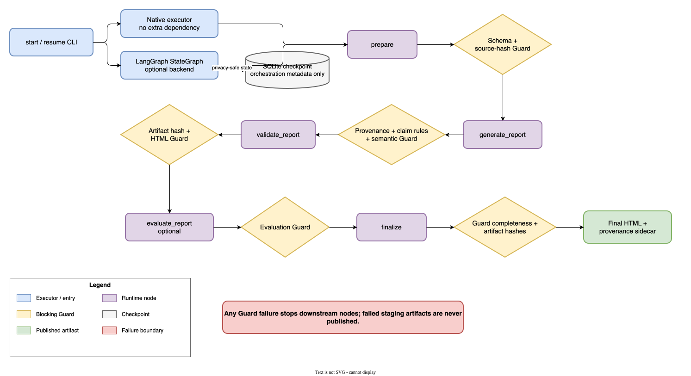

<div align="center">

# Interview Prep Skill

**Evidence-grounded interview preparation from a job description and your own resume.**

Generate a self-contained visual HTML report with role-resume fit analysis, resume-specific answers, project deep dives, bilingual practice, and a focused study plan for missing skills.

[](LICENSE)
[](https://www.python.org/)
[](#report-output)

<a href="./README.md"></a>
<a href="./README.cn.md"></a>

[Features](#features) · [Installation](#installation) · [Usage](#usage) · [Testing](#testing) · [License](#license)

</div>

---

## Features

- **Job-to-resume mapping** — classify each requirement as strong match, partial match, no evidence, or needs confirmation.
- **Resume-specific answers** — build first-person answers from the candidate's actual projects, responsibilities, decisions, and results.
- **Evidence ledger** — attach stable `JD-*`, `CV-*`, `USER-*`, and `SRC-*` IDs to factual claims.
- **Chinese and English support** — independently route the languages of the job description, resume, interview, report, and answers.
- **Project deep dives** — prepare technical, behavioral, pressure, and follow-up questions around real resume projects.
- **System-design practice** — derive 2–3 likely design prompts from JD signals, with requirements, architecture/data-flow diagrams, failure handling, trade-offs, and explicit assumptions.
- **Management-round preparation** — prepare high-value hiring-manager questions, evidence-backed answer strategies, pressure follow-ups, and boundaries for unsupported management experience.
- **Claim-level provenance guards** — bind rendered claims to hashed source spans and block unsupported facts, contribution escalation, numeric conflicts, and ambiguous inferences.
- **DAG runner and staged publication** — track guarded workflow state and publish HTML plus its provenance sidecar only after validation and optional evaluation pass.
- **Gap-focused study plan** — research first-party learning resources for important JD requirements that are missing from the resume.
- **Deterministic document extraction** — convert PDF and DOCX resumes into source-located intermediate Markdown before analysis.
- **Visual HTML by default** — produce one responsive, printable, self-contained file without CDN, remote fonts, analytics, or build steps.
- **Privacy-aware output** — exclude private phone numbers, email addresses, identity numbers, and detailed addresses from the report.

## How it works

[](docs/diagrams/interview-prep-workflow.en.drawio)

The diagram is generated with Draw.io and remains editable through the linked `.drawio` source.

## Report output

The default HTML report includes:

- role profile and material-completeness notice;
- language configuration and cross-language terminology;
- evidence ledger and requirement-to-resume match matrix;
- tailored self-introduction and reusable story bank;
- prioritized interview questions with 60–120 second reference answers;
- follow-up questions, project deep dives, technical questions, and pressure questions;
- 2–3 JD-derived system-design exercises with architecture/data-flow diagrams, reliability analysis, and trade-offs, or an explicit not-applicable result;
- 6–8 management-round questions with answer plans, story evidence, pressure follow-ups, and no-invention boundaries;
- gap-focused learning resources with time boxes and verifiable exercises;
- reverse questions, preparation plan, one-page cheat sheet, and confirmation list;
- section navigation, question search, expand/collapse controls, and print styling.

The report deliberately avoids unsupported match percentages, invented achievements, and claims that turn short-term study into production experience.

## Installation

### Install as a Codex skill

```bash
git clone https://github.com/chenyangwei-dev/interview-prep-skill.git \
  ~/.codex/skills/interview-prep
```

Restart or refresh Codex after installation so the skill can be discovered.

### Optional Python dependencies

The PDF extractor uses `pdfplumber` first and falls back to `pypdf`:

```bash
python -m pip install pdfplumber pypdf
```

DOCX extraction uses Python's standard library and does not require `python-docx`.

For development and coverage reporting:

```bash
python -m pip install "coverage>=7.10"
```

LangGraph is an optional execution backend and is only required with `--engine langgraph`:

```bash
python -m pip install -r requirements-langgraph.txt
```

Rendering PDF or DOCX pages for visual inspection may additionally require Poppler and LibreOffice in the execution environment.

## Usage

Invoke the skill with a job listing and a resume:

```text
Use $interview-prep with this job URL and my attached resume.
Generate a Chinese report, but prepare the interview answers in English.
```

Supported inputs:

| Material | Supported forms |
|---|---|
| Job listing | Public URL, pasted text, screenshot, PDF |
| Resume | PDF, DOCX, Markdown, plain text, pasted experience |
| Languages | Chinese, English, mixed-language inputs, bilingual practice |
| Default output | One self-contained `.html` file |

The default `native` workflow requires neither LangChain nor LangGraph. Select the optional LangGraph backend when durable graph checkpoints, future node-level recovery, or human-review extensions justify it.

## Guarded DAG runner

When the JD and resume are available as local files, create a run directory and normalized generation request:

```bash
python scripts/run_interview_prep.py start \
  --job work/job.json \
  --run-dir work/runs/example
```

Without a generator adapter, the runner exits with code `3` and prints `WAITING_FOR_GENERATION`. Generate both the requested HTML and its claim-level provenance manifest, then resume the same run:

```bash
python scripts/run_interview_prep.py resume \
  --run-dir work/runs/example \
  --report outputs/company-role-interview-prep.html \
  --provenance outputs/company-role-interview-prep.html.provenance.json
```

Inspect the declared content graph, executable runtime graph, or privacy-safe state:

```bash
python scripts/run_interview_prep.py plan
python scripts/run_interview_prep.py plan --runtime
python scripts/run_interview_prep.py status --run-dir work/runs/example
```

The executable runtime currently uses five coarse nodes: `prepare → generate_report → validate_report → evaluate_report (optional) → finalize`. The finer evidence, matching, story, system-design, and management nodes are declared for future chapter-level execution and caching, but still run inside the overall generator today.

Both execution backends call the same node functions and Guards:

[](docs/diagrams/guarded-dag-runtime.en.drawio)

Each runtime node is followed by its blocking Guard. The editable Draw.io source is linked from the image.

Select LangGraph explicitly:

```bash
python scripts/run_interview_prep.py start \
  --job work/job.json \
  --run-dir work/runs/example \
  --engine langgraph
```

LangGraph writes `langgraph-checkpoints.sqlite` in the run directory with orchestration metadata only: run ID, paths, return code, and last node. `state.json`, `guards/*.json`, and the provenance manifest remain authoritative for recovery, grounding, and publication. A LangGraph checkpoint does not prove that report content is source-supported.

The manifest must include the complete normalized-input hash set and bind every rendered claim through `data-claim-id`. Exact source facts can pass deterministic span checks; paraphrases and inferences require a configured semantic checker. Failed staging artifacts never overwrite the requested final report.

## Intermediate document extraction

Convert a PDF resume to Markdown:

```bash
python scripts/extract_pdf.py resume.pdf \
  --output /tmp/resume.extracted.md
```

Convert a DOCX resume to Markdown:

```bash
python scripts/extract_docx.py resume.docx \
  --output /tmp/resume.extracted.md
```

Use `--overwrite` only when intentionally replacing an existing intermediate file.

PDF locations use IDs such as `PDF-p001`. DOCX locations use paragraph and table coordinates such as `DOCX-body-p0001` and `DOCX-body-t01-r02-c01`. The analysis layer maps those physical locations to semantic evidence IDs such as `CV-01`.

Intermediate Markdown may contain personal resume data. Keep it in a temporary workspace, do not commit it to Git, and do not treat it as a default deliverable.

## Validate a generated report

```bash
python scripts/validate_report.py path/to/interview-prep-report.html
```

The validator checks required sections, unresolved placeholders, semantic structure, responsive and print styles, evidence-label guidance, unsafe inline handlers, `innerHTML`, and external asset dependencies.

Validation is not a replacement for visual inspection. Open the report at desktop and mobile widths and check navigation, long tables, question controls, and print layout before delivery.

## Testing

Run the fast, isolated unit tests:

```bash
python -m unittest discover -s tests/unit -p "test_*.py" -v
```

Run the cross-process and end-to-end regression tests:

```bash
python -m unittest discover -s tests/regression -p "test_*.py" -v
```

Run the deterministic Skill-output regression cases:

```bash
python evals/run_eval.py --use-samples --require-all
```

Run line and branch coverage:

```bash
python -m coverage erase
python -m coverage run \
  -m unittest discover -s tests/unit -p "test_*.py"
python -m coverage run \
  -m unittest discover -s tests/regression -p "test_*.py"
python -m coverage combine
python -m coverage report --fail-under=80 -m
```

Unit tests cover individual renderers, extractors, validators, and evaluators. Regression tests exercise complete command-line extraction, checkpointed workflow paths, DAG validation, provenance guards, and final-publication boundaries. `evals/run_eval.py` remains separate because it evaluates generated report quality rather than Python implementation units.

## Project structure

```text
interview-prep-skill/
├── .coveragerc                      # Branch and subprocess coverage configuration
├── README.md                        # English project documentation
├── README.cn.md                     # Simplified Chinese project documentation
├── requirements-langgraph.txt       # Optional LangGraph and SQLite checkpoint dependencies
├── LICENSE                          # Apache License 2.0
├── SKILL.md                         # Core workflow and behavioral contract
├── agents/openai.yaml              # Skill display metadata
├── assets/                         # Chinese and English HTML/Markdown templates
├── docs/diagrams/                  # Editable Draw.io sources and README SVG exports
├── references/                     # Evidence, language, questions, learning, HTML policies
├── scripts/
│   ├── extract_pdf.py              # PDF → source-located Markdown
│   ├── extract_docx.py             # DOCX OOXML → source-located Markdown
│   ├── extraction_common.py        # Shared Markdown schema and writer
│   ├── dag.py                       # Dependency graph declarations and validation
│   ├── provenance.py                # Source-span and claim provenance primitives
│   ├── guards.py                    # Blocking artifact and grounding guards
│   ├── langgraph_runtime.py         # Optional LangGraph StateGraph executor
│   ├── run_interview_prep.py        # Staged DAG runner and final publication gate
│   └── validate_report.py           # Deterministic HTML validator
├── evals/                          # Sanitized Skill-output regression cases and runner
└── tests/
    ├── unit/                       # Fast, isolated Python unit tests
    └── regression/                 # Cross-process and end-to-end Python regression tests
```

## Evidence and honesty boundaries

- Resume evidence supports candidate claims; general technical knowledge does not become personal experience.
- Team outcomes do not automatically become individual achievements.
- Missing numbers, roles, dates, and results remain marked as pending confirmation.
- Completing a study exercise does not change a resume requirement from “no evidence” to “matched.”
- External sources support learning material, not claims about the candidate's employment history.
- A real evidence ID alone is not sufficient: the referenced source span must support the rendered claim.
- Inferences, recommendations, assumptions, knowledge references, and unknowns remain explicitly labeled instead of being promoted to source facts.

## Contributing

Issues and pull requests are welcome for extraction edge cases, evidence safeguards, language quality, HTML accessibility, report validation, and new role-specific question patterns.

Before opening a pull request, run:

```bash
python -m unittest discover -s tests/unit -p "test_*.py" -v
python -m unittest discover -s tests/regression -p "test_*.py" -v
python evals/run_eval.py --use-samples --require-all
python -m coverage erase
python -m coverage run \
  -m unittest discover -s tests/unit -p "test_*.py"
python -m coverage run \
  -m unittest discover -s tests/regression -p "test_*.py"
python -m coverage combine
python -m coverage report --fail-under=80 -m
```

Do not commit real resumes, extracted personal data, generated reports containing private information, access tokens, or website session credentials.

## License

This project is licensed under the [Apache License 2.0](LICENSE).
